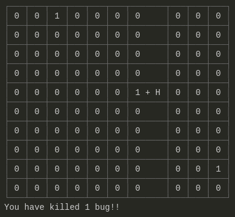
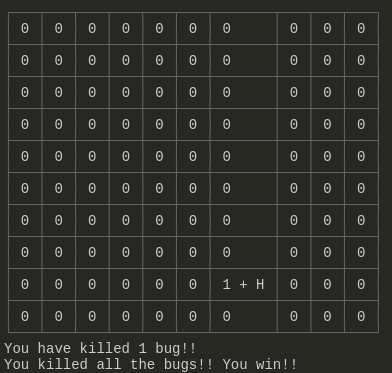

# Bug Hunter

This is just a command line game as proof of concept of Node.js working with the command line. For play just clone the repo and run `npm i && npm start`.

The goal of the game is very simple, you are a Bug Hunter and you must kill all the bugs in the map. You are the `H` in the map and on every cell the number of bugs inside are shown.  

 

Each turn the bugs can move or not. You can move in each turn up, down, left or right. However, you have to specify which direction you want to go between turns.

To specify the direction in which you want to move on the next turn you have to type it on the command line and press enter. The direction you specify will be the one the character will take until you specify a new one.

You kill a bug when you're in the same cell on the map. 

And you win when you kill the last bug.

